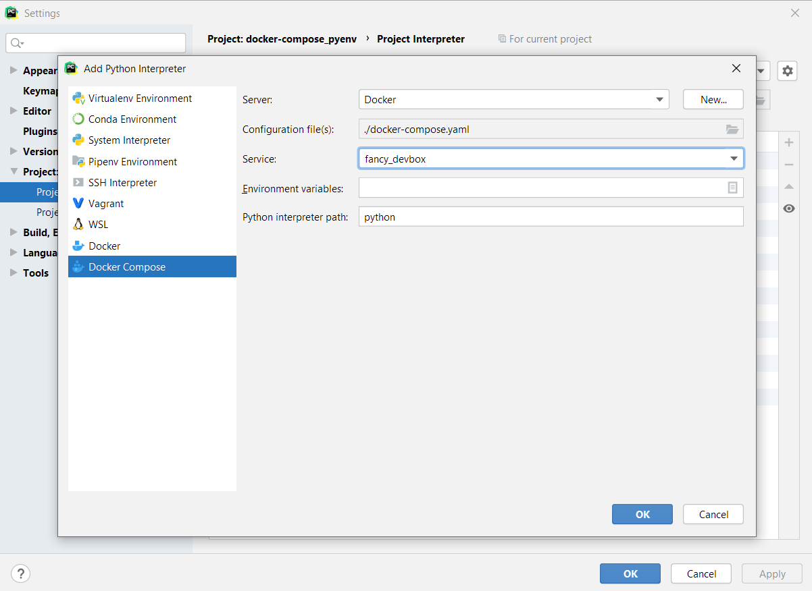

## Add Docker Compose Python Interpeter

Choose `fancy_devbox` service and use the default for Python interpreter path:



## Notes
* To explore `devbox` service:
  ```
  $ docker-compose run --entrypoint= --user root fancy_devbox bash
  ```

* The path to Python interpreter in `devbox` service: `/root/.pyenv/versions/app-context/bin/python3.8`.